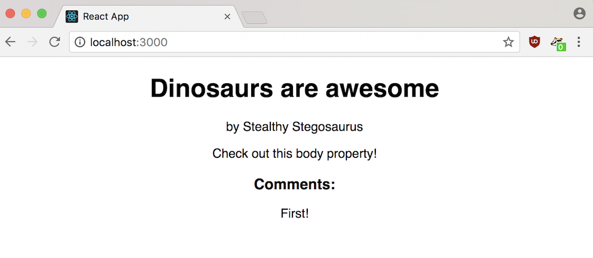

# You Do: A Blog Post

Let's have some practice creating a React component from scratch. How about a blog post?

1. Change directories back into the main directory where you want to keep your code (outside the `hello_world` React app directory we've been working on).

2. Referring to everything we've done up until now, create a new project using `create-react-app`. If you need to refresh your memory, refer to the Initial Setup section or view the official [`create-react-app` Github repository](https://github.com/facebookincubator/create-react-app).

  <blockquote> Note: Because create-react-app runs on port 3000, you'll have to stop the current `hello_world` app that's running in order to view this new app.</blockquote>

3. In `src/App.js`, change the `App` component to be a `Post` component.

4. Create a `post` object literal in `src/index.js` that has the following properties:
    - `title`  (example value: `"Dinosaurs are awesome"`)
    - `author` (example value: `"Stealthy Stegosaurus"`)
    - `body` (example value: `"Check out this body property!"`)
    - `comments` (example value: `["First!", "Great post", "Hire this author now!"]`)

5. Render a `Post` component with the information from your `post` object as its props values. For now, only include one of the comments. You decide how you want to display the title, author, body, and comment, or you can use the screenshot in the Solution section below as inspiration.  

6. Optional: adjust the CSS of your index file body to align your text to the center of the document.

## Solution

Your solution should look similar to this image:

If you'd like to run the solution code, use `npm install` and then `npm start` from inside the `solution-code` directory.
