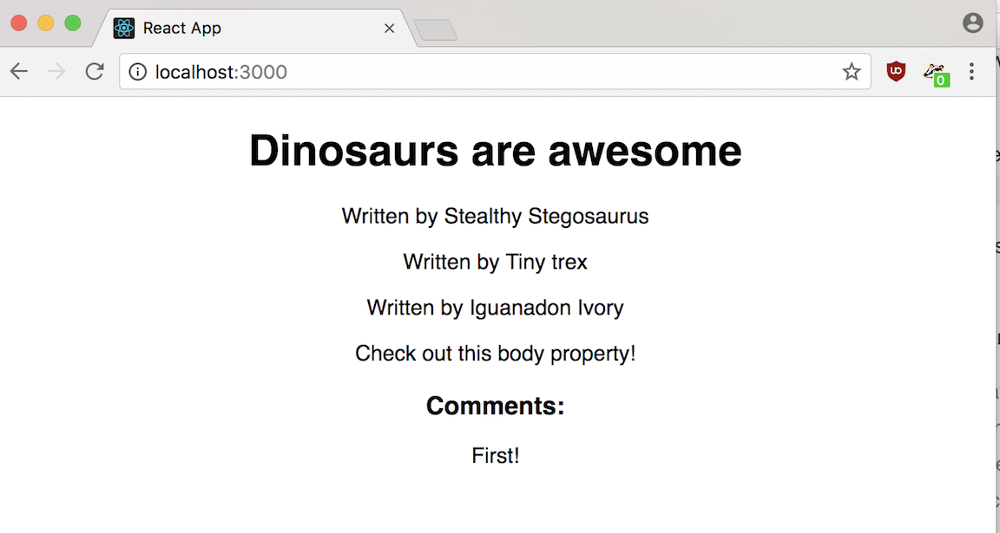

# You Do: Add Nested Posts To Blog

This blog is great so far! Now, our stegosaurus is actually collaborating more on the blog, so each post has multiple authors. Let's set that up.

### Steps

1. Modify the `Post` component to receive an `allAuthors` prop and pass in as a prop called `authorList` to the `Author` component class.

2. Create an `Author` component that renders "Written by ", followed by a list of the authors. The prop name should be `authorList`.

3. Amend your `Post`'s render method to include reference to a variable, `authors`, that is equal to the return value of generating multiple `<Author />` elements.

4. Make sure to pass in the `allAuthors` body as an argument to each `Author` component. Then render the `authors` somewhere inside the UI for a `Post`.

Besides Stealthy Stegosaurus, the other two authors are Tiny Trex and Ivory Iguanadon.

<blockquote>
Note: If you'd like, you can use JavaScript's array `map` method in `Post`'s `render` method to avoid having to hard-code all your `Author`s. Read more about it [here](https://developer.mozilla.org/en-US/docs/Web/JavaScript/Reference/Global_Objects/Array/map) and [here](http://cryto.net/~joepie91/blog/2015/05/04/functional-programming-in-javascript-map-filter-reduce/).
</blockquote>

<blockquote>
HINT 1: If you're using `map`, you should only have to return one `<MyPost />` inside of `map`.
</blockquote>

<blockquote>
HINT 2: Remember that whenever you write Javascript expressions inside of JSX, you need to surround them with single brackets (`{}`).
</blockquote>

## Solution

Your solution should look as follows:

