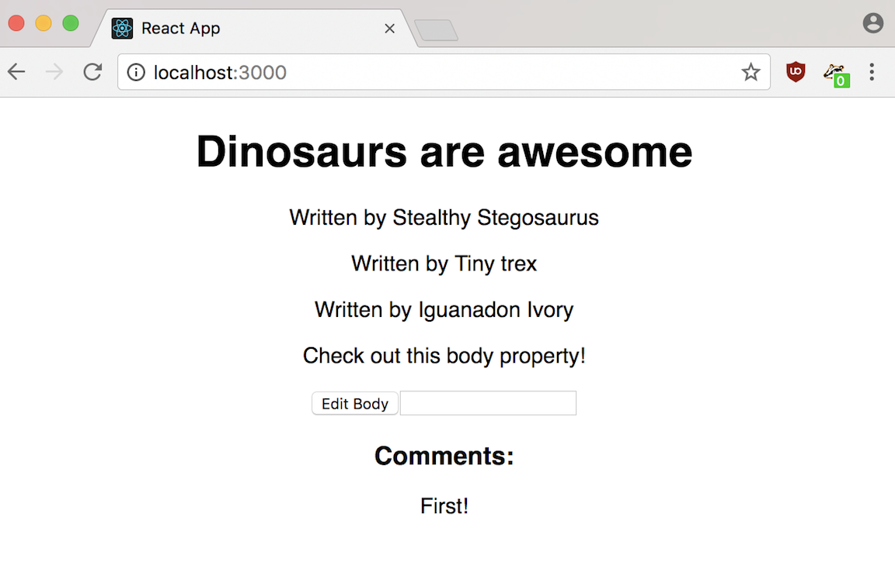

# You Do: Implement State (20 minutes) #

Let's implement state in our Blog by making __body__ a mutable value.
> Remember to switch the running application!

1. Initialize a state using a __constructor()__ method for our __Post__ to set a initial state. It should create a state value called __body__. Set it to the __body__ prop that's passed in to the component.
2. Modify __Post__'s __render__ method so that __body__ comes from __state__, not __props__.
3. Create a __changeBody__ method inside __Post__ that updates __body__ based on a user input.
  - You should use __setState__ somewhere in this method.
  - How can you get a user input? Keep it simple and start with __prompt__.
4. Add a button to __Post__'s __render__ method that triggers __changeBody__.

## Solution

Your solution should look as follows:

### Bonus I ###

Use a form to take in user input.

- The post body should be updated using a method that is triggered by __onSubmit__.
- One option is to keep track of what the new input is going to be by triggering a method using __onChange__ on the __< input >__
- Another option is to pass an event object to the __onSubmit__ method and traverse the DOM from __e.target__ to find the __< input >__ value.

## Bonus Solution

Your solution should look as follows:

Solution code for using __onChange__ here.
