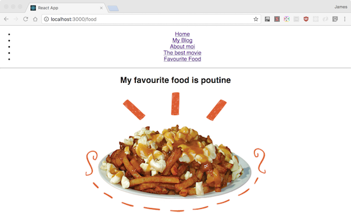

# You Do: Implement Router (20 minutes) #

You've been told your blog needs to have five pages:
- Homepage
- Main blog
- Favorite movie
- Favorite food
- About page

You already have the "Main blog" page.

Task:

- Create each page in your blog project (hint: These will be seperate .js files).
  - These pages don't have to have much content - just the header at the top saying what the page is and a paragraph description of your choosing.
- Create a navigation menu of list items that Route to each page. 
- Every time to click on a list item in navigation menu the corresponding page component should be rendered. This can be as simple or as complicated as you desire.
- Don't forget to `yarn add react-router react-router-dom` or `npm install react-router react-router-dom`

> *Hint*: You can instantiate a component with `props` inside of a `<Route>` element. An example is below:

```js
<Route path="/blog" component={
    () => (<Blog title={post.title}
              author={post.author}
              body={post.body}
              comments={post.comments} />
)}/>
```


## Solution

Your solution should look as follows:



