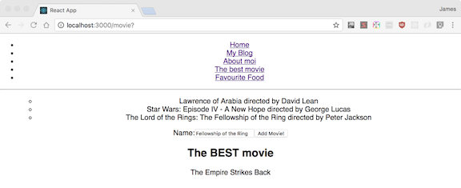

# You Do: Implement the ES6 fetch API (20 minutes) #

Still using Fetch and OMDB, recreate the Netflix carousel with your 10 favorite movies. 

- Add a `Carousel.js` for a new `Carousel` component to be used inside of your `Movie.js`.
- Put this in the "favorite movies" page in your blog project.
- Create a component that uses an input to search OMBD's API for a movie.
	- You will need an input element that listens to the eventOnChange method
	- When this event fires, take the `event.target.value` and `fetch()` from the OMDB api. 
	- OMDBI can be searched using query strings - `http://www.omdbapi.com/?t=Star+Wars` and returns a JSON result.
- Each time you query the server, a new list item should be added to your component by updating the carousel.
- You will need to break down each movie into a component as well as a a component that is a container (list) of all of them.

## Solution

Your solution should look similar to the following:

### Bonus I ###

> *This is a bonus as the Poster API is not free!*

- Replace the text for each movie's title with the movie poster image.
- You'll need to pay to get access to the OMDB [Poster API](http://www.beforethecode.com/projects/omdb/apikey.aspx). 
- This will be a replacement of the text element with an `` element pointing to the result of the movie poster API.